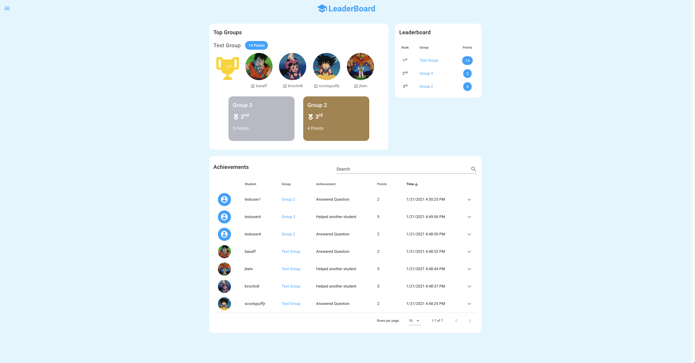

# Student LeaderBoard Client
This is the front end for a leader board application that tracks achievements of students in a class room setting in order to gameify the learning experience and encourage students to contribute in class.



This application is built with [vue.js](https://vuejs.org/) using components from [vuetify](https://vuetifyjs.com)

## Project setup

### Get Started
This application is Dockerized so simply run the following command to install all the dependencies and start a local server.
```
docker-compose up
```

### Back End Services
This application was developed to be utilized with the a custom API using Python and Django. The Student LeaderBoard API can be found [here](https://github.com/sakirschner/slb-api).

In order to properly save/access/manipulate data for this application please follow the steps outlined in the API's [README](https://gitlab.com/sakirschner/slb-api/-/blob/master/README.md) to run a local API server.

## Questions?
Please contact scottakirschner@gmail.com to learn more about utilizing this application!
